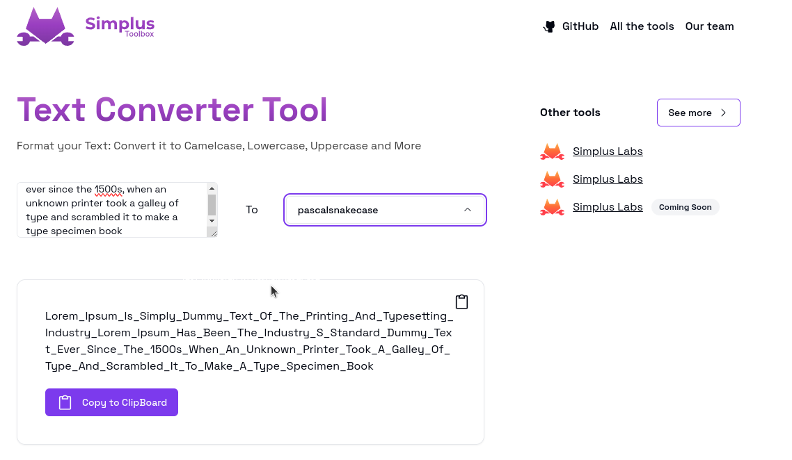

<h1 align="center">Simplus Text Converter</h1>

  <a href="#tech-stack--features">🌟 <strong>Features</strong></a> ·
  <a href="#tech-stack--features">🧰 <strong>Tech Stack</strong></a> ·
  <a href="#customize-to-your-needs">✨ <strong>Customize</strong></a>

 

**Text Converter Tool** offers a versatile solution to transform text effortlessly. Seamlessly convert text into various formats including CamelCase, lowercase, UPPERCASE, and more. This user-friendly application simplifies text formatting, enabling users to swiftly adapt text to their preferred style with ease and efficiency.

## 🌟 Features

- 🛠 **Funciones Versátiles**: Amplia gama de funciones, como camelCase, pascalCase, pascalSnakeCase, capitalCase, constantCase, dotCase, kebabCase, pathCase, sentenceCase, snakeCase y trainCase, para adaptar el texto a diversos estilos.

- 📱 **Interfaz Responsiva** : Diseñada para adaptarse y funcionar sin inconvenientes en dispositivos de cualquier tamaño, asegurando una experiencia óptima para el usuario.

## 🧰 Tech Stack

- [![React][React]][React-url]
- [![TypeScript][TypeScript]][TypeScript-url]
- [![ShadcnUI][ShadcnUI]][ShadcnUI-url]
- [![Tailwind][Tailwind]][Tailwind-url]
- [![Commitlint][Commitlint]][Commitlint-url]
- [![ESLint][ESLint]][ESLint-url]
- [![Prettier][Prettier]][Prettier-url]
- [![Vite][Vite]][Vite-url]
- [![Release-It]][Release-It-url]

## 📜 License

This project is licensed under the MIT License. See [LICENSE](CODE_OF_CONDUCT.md) for more information.

[SimplusLabs-url]: https://github.com/Simplus-Labs/
[React]: https://img.shields.io/badge/React-61DAFB.svg?style=for-the-badge&logo=React&logoColor=black
[React-url]: https://reactjs.org/
[TypeScript]: https://img.shields.io/badge/TypeScript-3178C6.svg?style=for-the-badge&logo=TypeScript&logoColor=white
[TypeScript-url]: https://www.typescriptlang.org/
[ShadcnUI]: https://img.shields.io/badge/ShadcnUI-000000.svg?style=for-the-badge&logo=ShadcnUI&logoColor=white
[ShadcnUI-url]: https://shadcn.com/
[Tailwind]: https://img.shields.io/badge/Tailwind%20CSS-06B6D4.svg?style=for-the-badge&logo=Tailwind-CSS&logoColor=white
[Tailwind-url]: https://tailwindcss.com/
[Vite]: https://img.shields.io/badge/Vite-646CFF.svg?style=for-the-badge&logo=Vite&logoColor=white
[Vite-url]: https://vitejs.dev/
[Commitlint]: https://img.shields.io/badge/commitlint-000000.svg?style=for-the-badge&logo=commitlint&logoColor=white
[Commitlint-url]: https://commitlint.js.org/
[ESLint]: https://img.shields.io/badge/ESLint-4B32C3.svg?style=for-the-badge&logo=ESLint&logoColor=white
[ESLint-url]: https://eslint.org/
[Prettier]:https://img.shields.io/badge/Prettier-F7B93E.svg?style=for-the-badge&logo=Prettier&logoColor=black
[Prettier-url]: https://prettier.io/
[Release-It]:https://img.shields.io/badge/ReleaseIt-000000.svg?style=for-the-badge&logo=ReleaseIt&logoColor=white
[Release-It-url]: https://github.com/release-it/release-it